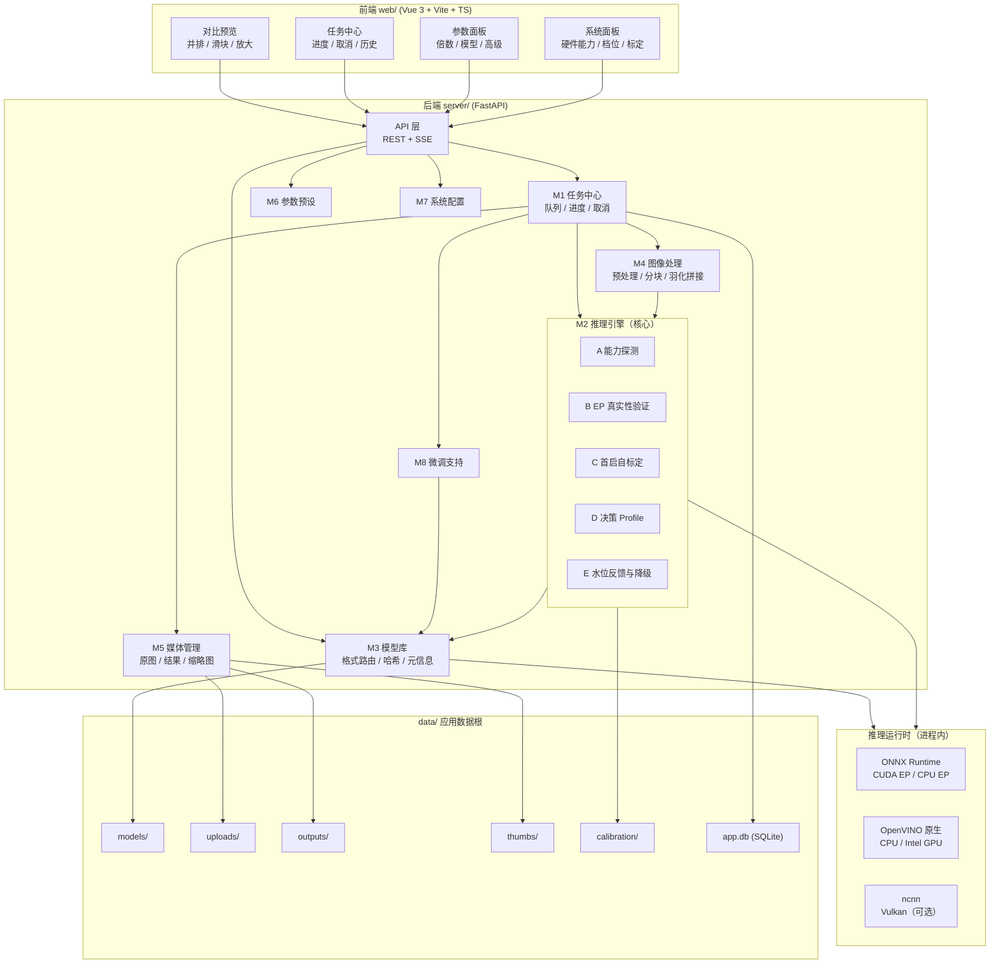
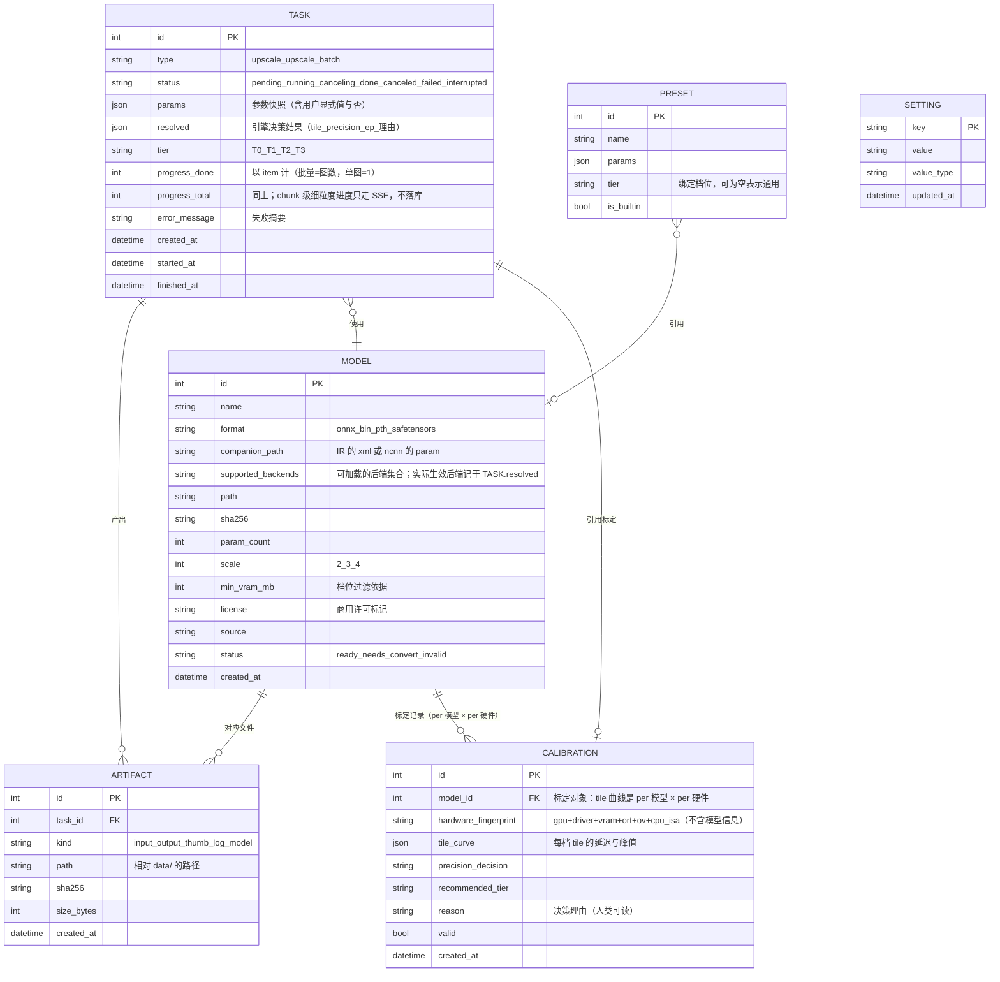

# 技术架构文档

| 项 | 值 |
|---|---|
| 项目 | **WebSR · 图像超分与修复 Web 应用** |
| 版本 | v1.2 |
| 日期 | 2026-09-30 |
| 阶段 | 步骤 3（技术架构设计） |
| 拓扑 | 前后端分离，本机直接运行 |
| 状态 | 待验收 |

**依据文档**：`docs/prd/prd.md`（v1.5，已验收） ｜ `docs/rules/project-rules.md` ｜ `docs/tech/research/`（6 份前置调研与实测）

---

## 1. 架构目标与约束

### 1.1 三条不可违背的约束

| # | 约束 | 来源 | 对架构的强制影响 |
|---|---|---|---|
| 1 | **机制硬编码，数值运行时求** | 用户确立；P0 实测 | 引擎必须分五阶段（探测→验证→标定→决策→反馈）；tile/精度/EP/并发度**不得**出现在配置默认值里 |
| 2 | **档位一等配置，能力声明驱动** | 用户要求"高端功能也实现但无法测试" | 档位维度贯穿数据模型与 UI；必须内置档位模拟开关；禁止按型号硬编码 |
| 3 | **推理栈是 Python，环境隔离在项目内** | 用户要求；既有资产 | 后端必须 Python；应用依赖集中在 `.venvs/sr-app`，不得污染三个基准环境 |

### 1.2 架构目标

- **一次开发、四处部署**：同一份代码在 T0（纯 CPU）/ T1（消费级独显）/ T2（高端）/ T3（专业卡）上都能跑，各自拿到**属于自己**的最优参数
- **可观测**：任何"为什么这台机器这样跑"的问题，都能用一个诊断 JSON 回答
- **可演进**：扩散模型池（F-17）与浏览器 WebGPU 通道（F-18）将来接入时，是**新增实现**而非重写

---

## 2. 系统总体架构

### 2.1 分层视图



### 2.2 核心模块划分与依赖方向

**依赖是单向的，禁止循环；禁止跨模块直接访问数据。**

| 模块 | 职责 | 依赖 | 被谁依赖 |
|---|---|---|---|
| **M1 任务中心** | 所有长任务的统一入口：入队、调度、进度广播、取消、历史、状态机 | M2 / M4 / M5 / M8 | API 层 |
| **M2 推理引擎** | 五阶段自适应：探测 → EP 验证 → 标定 → 决策 → 水位反馈。**唯一推理出口**；**编排推理循环**（调用 M4 分块 → 逐块 infer → 调用 M4 羽化拼接） | M3 / M4 | M1 |
| **M3 模型库** | 4 种格式登记与路由、哈希校验、参数量/许可证/最低显存等元信息、导入导出 | 运行时 | M2 / M8 |
| **M4 图像处理** | 预处理（BGR/归一化/尺寸约束）、分块、**overlap + feather 拼接**、后处理、格式转换。**无状态纯算法库**：不做后端选择、不编排循环、不感知 EP 与进度 | — | M2 |
| **M5 媒体管理** | 原图/结果/缩略图的存储、检索、清理、对比预览所需的资源 | — | M1 / API |
| **M6 参数预设** | 参数组合的保存/加载/删除，**绑定档位** | — | API |
| **M7 系统配置** | 数据根、并发上限、日志、保留策略、标定状态展示 | M2（读标定） | 全模块 |
| **M8 微调支持** | 数据集打包导出（仅 HR，自动生成配对 LR）、训练脚本模板、训练产物回灌 M3。**应用内不承载训练执行**（F-13 离线形态，无 PyTorch 训练栈） | M3 | M1 |

**关键不变量**

1. **推理出口唯一**：任何推理调用必须经 M2，业务代码不得自行创建推理会话
2. **M2 不认识具体模型**：它只处理"一个已加载的引擎 + 一组能力声明"
3. **M4 不做后端选择**：分块与拼接策略由 M2 的决策结果驱动
4. **M4 是无状态纯算法库**：不持有会话、不编排循环、不感知 EP 与进度；分块尺寸、overlap、feather 权重等一律作为**参数**由 M2 传入。这也是 §2.2 模块表中依赖方向为 **`M2 → M4`**（而非 `M4 → M2`）的原因——避免双向依赖

### 2.3 数据流向

```
上传图片
  └─▶ M5 落盘 data/uploads/ ──▶ 生成缩略图 data/thumbs/
        │
        └─▶ M1 建任务（写 app.db，状态=待执行）
              │
              ▼
        M1 调度（并发度由 M7 配置，上限由 M2 标定反推）
              │
              ▼
        参数决策：用户显式值 ──或── M2 决策结果（"自动"档）
              │
              ▼
        M3 加载模型（按格式路由；.onnx 优先，IR/ncnn 次之）
              │
              ▼
        M2 编排推理：调用 M4 分块 ─▶ 逐块 infer ─▶ 调用 M4 做 overlap+feather 拼接
              │         │
              │         └─▶ 进度事件 ──SSE──▶ 前端进度条
              │
              ▼
        M5 落盘 data/outputs/ ──▶ M1 更新任务状态（短事务）
              │
              ▼
        前端对比预览（原图 vs 结果）
              │
              ▼
        水位反馈：M2 记录峰值显存/内存 ──▶ 连续高位则降档并提示
```

---

## 3. 技术栈选型

| 层 | 选择 | 版本 | 选型理由（摘要） | ADR |
|---|---|---|---|---|
| 前端框架 | **Vue 3 + Vite** | 装时确定 | 生态成熟、上手快、体积小，适合工具型界面 | [ADR-001](arch/ADR-001-前后端技术栈选型.md) |
| 前端语言 | **TypeScript** | 装时确定 | 与后端契约对齐，减少字段错配 | ADR-001 |
| UI 组件库 | 待定（步骤 5A） | — | 候选 Element Plus / Naive UI | — |
| 后端框架 | **FastAPI** | 装时确定 | **Python 是硬约束**（推理栈）；原生 async + SSE 契合长任务 | ADR-001 |
| ASGI 服务器 | uvicorn | 装时确定 | FastAPI 标准搭配 | ADR-001 |
| 数据库 | **SQLite**（WAL） | Python 内置 | 零配置、单文件、随数据根迁移；与"不做 Docker"契合 | [ADR-002](arch/ADR-002-元信息库选SQLite.md) |
| ORM | SQLAlchemy 2.x + Alembic | 装时确定 | 抽象掉 SQLite 特性，便于将来迁 PostgreSQL | ADR-002 |
| 数据校验 | Pydantic v2 | 随 FastAPI | 请求/响应 DTO 与配置校验 | ADR-001 |
| 推理运行时 | ONNX Runtime / OpenVINO / ncnn | 见 `dev-info.md` §5.1 | 复用已验证资产 | [ADR-003](arch/ADR-003-模型格式支持策略.md) |
| 异步任务 | 进程内队列 + SSE | — | 零额外基础设施；推理不占事件循环 | [ADR-005](arch/ADR-005-推理内嵌与异步任务.md) |
| 档位机制 | 能力声明 + 档位模拟 | — | 让"无硬件可验证"变成"控制面可验证" | [ADR-004](arch/ADR-004-硬件档位一等配置.md) |
| 部署 | 本机直接运行 | — | **不做 Docker**（v2 再议） | ADR-001 |

---

## 4. 核心数据模型

### 4.1 ER 关系



### 4.2 关键设计说明

| 设计 | 理由 |
|---|---|
| `TASK.params` 与 `TASK.resolved` **分开存** | 前者是用户意图（可能含"自动"），后者是引擎决策结果。分开存才能回答"为什么这台机器用了这个 tile"，也是 NFR 里"决策理由可追溯"的落点 |
| `TASK.tier` **冗余存一份** | 便于按档位统计与排查；档位来自引擎探测，不是用户输入 |
| `MODEL.min_vram_mb` | **UI 按档位过滤的唯一依据**（PRD §2.2 F-05）。没有它就无法把 T2/T3 模型在 T1 上正确置灰。⚠️ **它是"门槛"不是"排序"**：本项只做**可用性门控**，**引擎不做模型推荐**（PRD §7.3，2026-09-30 用户决定），模型始终由用户指定 |
| `MODEL.companion_path` | `.bin` 必须成对（`.xml` 或 `.param`），见 ADR-003。字段为空即判定导入非法 |
| `MODEL.status = needs_convert` | `.pth`/`.safetensors` 登记后处于"需先转换"状态，UI 据此显示转换入口而非报错 |
| `CALIBRATION.model_id` + `hardware_fingerprint` **拆开存** | tile 曲线是 **per-(模型 × 硬件)** 的——同一张卡换个模型，最优 tile 就会变。因此**指纹只放硬件项**（gpu/driver/vram/ort/ov/cpu_isa），模型用外键。失效判据 = 指纹变化 / 超期 / 连续降档 ≥ 2 次 / **该模型的哈希变化** |
| `MODEL.supported_backends` **存集合而非单值** | 同一模型可被多个后端加载；而"**实际生效**后端"受 EP 真实性验证（§6.1 阶段 B）影响，属运行时决策，只记在 `TASK.resolved`，不在模型上重复存 |
| `TASK.status` 含 `canceling` | PRD §6.2 要求"取消中"对用户可见。取消是**协作式**的（ADR-005：分块循环逐块检查标志），点取消后先进入 `canceling`，线程确认退出才转 `canceled` |
| 时间字段存 **UTC** | 展示层按 `Asia/Shanghai` 转换，避免时区歧义 |
| 图片**不存库**，只存相对路径 | 与 ADR-002 一致；路径相对 `data/` 存储，便于整个数据根迁移 |

---

## 5. API 交互规范

### 5.1 通用约定

| 项 | 约定 |
|---|---|
| 风格 | RESTful，前缀 `/api` |
| 绑定 | **`127.0.0.1:8000`**（本地单机形态，禁止 `0.0.0.0`） |
| 鉴权 | **v1 无**（单机自用）。若将来开放局域网，**必须先补鉴权** |
| CORS | 开发期用 Vite proxy 规避；若直接跨域，白名单限定 `http://127.0.0.1:5173`，**禁止 `*`** |
| 时间 | 请求/响应统一 ISO 8601 UTC |
| 分页 | `?page=1&page_size=20`，响应含 `total` / `page` / `page_size` / `items` |
| 上传 | `multipart/form-data`；扩展名白名单 + **服务端二次校验真实格式**（不信任扩展名） |
| 路径安全 | 所有文件路径做规范化校验，**禁止拼接用户输入直接访问文件系统** |
| 上传上限 | 由 `APP_MAX_UPLOAD_MB` 控制 |
| SSE 与 worker | **uvicorn 必须单 worker**：SSE 依赖**进程内广播**，多 worker 下同一任务的订阅连接与推送可能落在不同进程，事件会随机丢失。这是 ADR-005「单进程、进程内任务队列」约束在接口层的落点 |

### 5.2 统一响应与错误码

```json
// 成功（示例：任务详情）
{ "id": 12, "status": "running", "progress": { "done": 3, "total": 12 } }

// 失败
{
  "error": {
    "code": "ENGINE_OOM_DOWNGRADED",
    "message": "显存不足，已自动降到 tile 256 并重试",
    "hint": "当前可用显存 2.1 GB，建议关闭占用显存的程序",
    "detail": { "attempted_tile": 384, "final_tile": 256 }
  }
}
```

| 错误码 | HTTP | 含义 |
|---|---|---|
| `VALIDATION_FAILED` | 400 | 参数非法 |
| `UNSUPPORTED_FORMAT` | 400 | 文件格式不在允许列表 |
| `MISSING_COMPANION_FILE` | 400 | `.bin` 缺少配套 `.xml` / `.param` |
| `NOT_FOUND` | 404 | 资源不存在 |
| `TASK_CONFLICT` | 409 | 任务状态不允许该操作（如取消已完成任务） |
| `PAYLOAD_TOO_LARGE` | 413 | 超过上传上限 |
| `ENGINE_UNAVAILABLE` | 503 | 无可用推理后端（需降级或提示装驱动） |
| `ENGINE_OOM_DOWNGRADED` | 200/202 | **不是错误**：已自动降档并继续，作为警告事件返回 |
| `INTERNAL_ERROR` | 500 | 未预期异常（须落盘日志） |

> 设计取向：**降级不是错误。** 自动降档、EP 回退这类情况以"警告事件"形式随正常响应返回，并在 UI 上显式展示，而不是伪装成失败（PRD §7 要求"不得静默降级"）。

### 5.3 接口清单

| 方法 | 路径 | 作用 | 备注 |
|---|---|---|---|
| POST | `/api/tasks` | 提交任务（单图/批量/微调） | 立即返回任务号，**P95 ≤ 300 ms** |
| GET | `/api/tasks` | 任务列表 | 按状态/类型过滤 + 分页 |
| GET | `/api/tasks/{id}` | 任务详情 | 含 `params` 与 `resolved`（决策理由） |
| GET | `/api/tasks/{id}/events` | **SSE** 进度流 | 见 §5.4 |
| POST | `/api/tasks/{id}/cancel` | 取消任务 | 协作式，≤ 2 s 生效 |
| GET | `/api/tasks/{id}/artifacts` | 产物列表 | — |
| POST | `/api/files/upload` | 上传图片/模型 | 返回文件句柄 |
| GET | `/api/files/{id}/content` | 取文件内容 | 支持 Range（大图预览） |
| GET | `/api/models` | 模型列表 | 支持 `?tier=T1` 过滤，返回 `available: bool` + 不可用原因 |
| POST | `/api/models/import` | 导入模型 | **必须校验配套文件**（`.bin`） |
| POST | `/api/models/{id}/convert` | 触发 `.pth`/`.safetensors` → `.onnx` 转换 | ADR-003 |
| GET | `/api/models/{id}/export` | 导出模型 | — |
| DELETE | `/api/models/{id}` | 删除模型 | 内置模型禁删 |
| GET | `/api/system/capabilities` | 硬件能力（含 **EP 验证证据**） | 见 §6.2 |
| POST | `/api/system/calibrate` | 触发首启自标定 | 异步，返回任务号 |
| GET | `/api/system/calibration` | 标定结果与理由 | — |
| GET | `/api/system/diagnostics` | **一键导出诊断 JSON** | 硬件事实 + EP 验证 + 标定记录 |
| GET / PUT | `/api/settings` | 读写系统配置 | — |
| GET / POST / DELETE | `/api/presets` | 参数预设 CRUD | — |

### 5.4 SSE 事件格式

```
event: progress
data: {"task_id":12,"stage":"infer",
       "item":{"done":2,"total":30},"chunk":{"done":3,"total":12},
       "percent":7.5,"elapsed_ms":41200,"eta_ms":524000}

event: warning
data: {"code":"ENGINE_OOM_DOWNGRADED","message":"已降到 tile 256","detail":{"from":384,"to":256}}

event: done
data: {"task_id":12,"status":"done","artifacts":[{"id":31,"kind":"output"}]}

event: error
data: {"code":"ENGINE_UNAVAILABLE","message":"无可用推理后端","hint":"请安装/更新显卡驱动"}
```

**两级进度的语义（必须按此实现，避免"30 张图每张 12 块"时口径不一）**

| 字段 | 含义 | 适用 |
|---|---|---|
| `item` | **任务项**级进度：批量 = 第几张图，单图 = `{done:1, total:1}` | 所有任务都有 |
| `chunk` | **分块**级进度：当前这张图内第几块 | 单图推理中；批量任务的非当前项不推进 |
| `percent` | **以 `item` 为准**（批量按图数计，单图按 chunk 计） | 单一权威口径，界面直接用 |
| `total = 0` | 该维度**此阶段不适用**（如尚在预处理）：界面不得显示为 0/0 或 NaN | 防御性约定 |

**约束**：进度事件**节流 ≤ 1 s 一次**；`done`/`error` 为终止事件，发出后关闭连接；前端断线后可用 `GET /api/tasks/{id}` 恢复状态（SSE 降级通道）。

---

## 6. 关键机制设计

### 6.1 M2 推理引擎：五阶段

| 阶段 | 时机 | 产物 | 失败处理 |
|---|---|---|---|
| **A 能力探测** | 每次启动（毫秒级） | `DeviceFacts` | 单项失败记入 `probes_failed` 并继续，**绝不抛异常** |
| **B EP 真实性验证** | 首次 / 硬件变化 | `VerifiedBackend[]` | 未通过即从候选链剔除，记入异常事件 |
| **C 首启自标定** | 首次运行（异步，≤ 8 s 预算） | `CalibrationRecord`（tile 曲线 + 精度判定） | 超预算停在当前最优档 |
| **D 决策** | 每个任务 | `RuntimeProfile`（**tile / 精度 / EP / 决策理由**；**不含模型选择**——模型由用户指定，见 §4.2） | 任一输入缺失（如标定未完成）即落到**保底档**（§6.8），并在 `RuntimeProfile` 标记 `using_fallback` |
| **E 运行时反馈** | 每个任务前后 | 水位记录、降档/升档 | 连续 2 次 > 85% 降档；OOM 降档重试一次 |

**EP 真实性验证的判据（不可简化）**：

> 唯一可信证据是 ORT profiling JSON 的**节点级归属**。
> `session.get_providers()` 只证明 EP 对象被创建，**不证明它执行了计算**——ORT 在 EP 失败时只打一条 warning 就静默回退 CPU。
> 判定规则：**该 EP 节点数 > 0 且 CPU 节点数 = 0**。节点数 = 1 是"整图融合为单个子图"的正常现象，**不能据此判为未接管**。

### 6.2 能力声明字段（档位与分支的唯一依据）

| 字段 | 类型 | 用途 |
|---|---|---|
| `tier` | `T0`–`T3` | UI 与调度策略的总开关 |
| `vram_total_mb` / `vram_available_mb` | int | **实读**，不是标称值；tile 标定与模型过滤 |
| `ram_available_mb` | int | **T0 档的瓶颈是物理内存而非显存** |
| `supports_fp16` | bool | 无 fp16 单元的 CPU 上必须为 false（实测 fp16 反而更慢） |
| `supports_batch` | bool | G-02 |
| `supports_tile0` | bool | G-01（不分块整图） |
| `has_tensorrt` | bool | G-04 |
| `is_generative` | bool | 扩散池（F-17）的输出需标注"生成内容" |
| `num_inference_steps` | int? | 推理步数。CNN/GAN 类为空，扩散类必填。**PRD §7.1「为后续演进预留接缝」要求的字段** |
| `requires_prompt` | bool | 是否需要文本 prompt（扩散类）。同为接缝字段；缺了它，F-17 接入时仍要改接口签名 |
| `ep_node_assignment` | dict | **EP 验证证据**，必须随能力面板一并展示 |
| `simulated` | bool | **该结果是否来自档位模拟**（见 §6.3） |

**档位判定规则（`tier` 由能力声明推导，不独立探测、不按设备型号）**

| 顺序 | 条件（自上而下，首个命中即定档） | 判定为 |
|---|---|---|
| 1 | 可用显存 **≥ 48 GB**（与 PRD §2.3 的 T3 定义一致） | `T3` 专业卡 |
| 2 | 可用显存 **≥ 16 GB**（与 PRD §2.3 的 T2 定义一致） | `T2` 高端 |
| 3 | 存在**已验证**的 GPU 后端（ORT CUDA EP；或 Intel GPU 经 OpenVINO **原生** API） | `T1` 消费级 |
| 4 | 其余 | `T0` 纯 CPU |

**四条约束**

1. 判据必须是**实读可用显存**（走 nvml / 设备查询），**不是标称值**——同一张卡在不同占用下可能落不同档，因此档位随每次探测更新，不是一个开机定死的常量。
2. 第 3 条只有在后端**已验证**时才成立；`session.get_providers()` **不算证据**（判据见 §6.1 阶段 B）。
3. 此处的阈值是**判定规则（机制）**，不是产品参数——与"数值运行时求"不冲突（PRD §1.4）；允许 `force_tier` 绕过（§6.3）。代码中**禁止**出现 `if "4090" in gpu_name` 这类判断。
4. Intel 集显（必须读 `FULL_DEVICE_NAME`，**禁止**用 `"GPU" in available_devices`）暂按第 3 条归入 `T1` 候选；**实际档位由首次标定裁决**——若标定显示其不优于 CPU 路径，则回落 `T0`（与 `project-rules.md` §2.2 铁律 3 一致）。

### 6.3 档位模拟（让不可验证变成可验证）

允许强制声明能力，绕过真实探测：

```
force_tier=T2
force_vram=24576
force_has_tensorrt=true
```

用于在 T1 机器上真实执行 T2/T3 的代码路径（档位判定、能力门控、UI 置灰/解禁、参数传递、调度策略切换、错误与降级链）。

**约束**：
1. 仅在开发者设置中开放，UI 显式提示"模拟档位不代表真实能力"
2. 模拟结果必须标记 `simulated: true`，且**不得写入正式标定缓存**
3. **P3 代码失败必须可安全绕过**，不得影响 T1 用户

### 6.4 模型格式路由（ADR-003 的实现形态）

```
导入文件
  ├─ .onnx            ─▶ ORT(CUDA/CPU EP) 或 OpenVINO(转 IR)      ← 主路径
  ├─ .bin + .xml      ─▶ OpenVINO 原生
  ├─ .bin + .param    ─▶ ncnn（**条件支持**：Windows/Python 可用性验证通过前不计入 v1 承诺；失败一律降级）
  ├─ .bin 单独        ─▶ ✗ 拒绝，提示需要配套文件
  ├─ .pth             ─▶ 登记为 needs_convert，提供转换入口
  └─ .safetensors     ─▶ 同上（需 architecture 元数据识别结构）
```

### 6.5 分块与羽化（质量红线）

- tile 尺寸由阶段 C 标定决定，**不写死**
- 拼接必须做 **overlap + feather 加权混合**；仅平移窗口或仅加 pad **都会留下可见接缝**
- 现有 `tools/_bench_common.py::tiled_infer` **无羽化**，是基准用的形状验证器，**生产实现必须重写**（T-802）

### 6.6 后端启动序列（阻塞 / 非阻塞边界）

启动分两步，**只有第一步阻塞**——这决定"进程起来后多久能接第一个任务"。

| 步骤 | 内容 | 阻塞？ | 失败处理 |
|---|---|---|---|
| **1 就绪** | 载入配置 → 建库/迁移（SQLite WAL）→ **注册推理运行时 DLL 路径**（Windows 必须在 import 推理库**之前**完成）→ 把上次遗留的 `running` / `canceling` 任务回收为 `interrupted` 并提示用户 | ✅ **阻塞** | 数据库不可用 → **拒绝启动并明确报错**；DLL 注册失败 → 降级为仅 CPU 可用，不阻断启动 |
| **2 能力** | 阶段 A 能力探测（毫秒级）→ 阶段 B EP 真实性验证（**命中缓存才快**，否则要跑一次 profile 采样）→ 若无有效标定，投递后台标定任务（阶段 C） | ❌ 非阻塞 | 任一步失败只记**异常事件**，界面显示"标定中"，任务按**保底档**（§6.8）继续执行 |

**两条硬约束**

1. **EP 验证结果与标定结果必须落缓存**（`data/calibration/`），否则每次启动都要重跑 profile，首屏体验不可接受。
2. 启动时把 `running` → `interrupted` 的回收必须**幂等**，且与 ADR-005 §实施约束 2 的状态机一致。

### 6.7 与既有基准工具的关系（`tools/`）

`tools/`（11 个 `.py`）是**开发期基准与探测工具**，**不参与应用运行时**。其中三项逻辑必须**重写为产品代码**进入 `server/app/engine/`，而不是被调用：

| 工具 | 其逻辑在产品中的落点 |
|---|---|
| `_runtime_env.py`（Windows DLL 路径注册） | §6.6 启动序列第 1 步——必须在导入推理运行时**之前**完成 |
| `p0_1_cuda_smoke.py`（EP 真实性验证） | 阶段 B（§6.1）——判据不变：**该 EP 节点数 > 0 且 CPU 节点数 = 0** |
| `p0_2_vram_matrix.py`（可信显存读取） | 阶段 A 能力探测 + 阶段 E 水位反馈 |

**约束**：产品代码**不得** `import tools/`；`tools/` 保持可独立运行的基准形态，继续作为 `.workbuddy/results/` 的复现基线。

### 6.8 保底档（冷启动的显式例外）

PRD §1.4 的"数值运行时求"有一条**显式例外**：标定完成之前的**保守下界参数**。

| 时刻 | 参数来源 |
|---|---|
| 标定**未完成**（含首次启动、标定失败） | **保底档**：最小可用 tile、`fp32`（不论 GPU/CPU）、并发 1、EP 取"已验证列表"首项 |
| 标定**已完成且有效** | `CalibrationRecord` 的决策结果（阶段 D） |

**四条规则**

1. 保底档的每个取值必须是**下界**——只允许保守、不允许激进；**不得取开发机实测值**（它是"任何环境都不会 OOM"的下界，不是"这台机器的最优值"）。
2. 保底档**不写入** `CalibrationRecord`，也**不写入**模型元信息（否则会被后续继承当成真实结论）。
3. `RuntimeProfile.using_fallback = true` 时界面**必须显示**"当前为保底档（标定中/标定失败）"，标定完成后自动切档并提示——对应 PRD"降级必须显式"。
4. 若标定**连续失败**，长期停留在保底档是**允许**的（可用性优先），但该状态必须持续可见，不得静默。

---

## 7. 风险与未决项

| # | 风险 / 未决 | 影响 | 应对 | 何时解决 |
|---|---|---|---|---|
| 1 | **ncnn 在 Windows/Python 下的获取方式未验证** | ADR-003 的 ncnn 支持可能落空 | 先验证 pip wheel 可用性；不可行则降级为调用 `realesrgan-ncnn-vulkan` 可执行文件。**验证通过前，ncnn 一律按"条件支持"表述，不计入 v1 承诺**（PRD §7.2 / §7.5） | **实现前（步骤 4 拆解时列为验证任务，T-210）** |
| 2 | ncnn "黑图"已知 bug / Vulkan 不可用 | 该后端输出全黑 | ncnn 定位为**条件支持后端**，探测失败即降级；加载失败不影响其它格式 | 实现期 |
| 3 | `.pth`/`.safetensors` 转换依赖 PyTorch 仍会进"转换工具"环境 | 转换工具环境体积大 | 转换工具与主应用**依赖分离**（独立 venv 或按需安装），主应用保持轻量 | 步骤 4 |
| 4 | CPU 档能否实用未确定（SPAN/SAFMN 速度未测） | T0 的产品承诺可能落空 | 列为引擎 P0（T-801），先测再定 CPU 档承诺 | **实现前** |
| 5 | P3（T2/T3）数据面无法验证 | 性能与显存行为未知 | 档位模拟验证控制面 + 交付标注"未验证" + 用户侧自标定兜住 | 有硬件时 |
| 6 | 推理与 API 争抢资源 | 长任务期间接口变慢 | 推理放独立执行器；实测验证 | 实现期 |
| 7 | 进程内推理崩溃连带后端 | 服务整体不可用 | P3/实验性后端放独立子进程，异常不得穿透 | 实现期 |
| 8 | 任务历史随重启丢失"运行中"状态 | 状态不一致 | 启动时把 `running` 回收为 `interrupted` 并提示用户 | 实现期 |
| 9 | 前端契约与后端 DTO 手工对齐易漂移 | 字段错配 | 步骤 5B 冻结 OpenAPI 契约，前端由契约生成类型 | 步骤 5B |

---

## 8. 架构决策记录索引

| 编号 | 标题 | 状态 |
|---|---|---|
| [ADR-001](arch/ADR-001-前后端技术栈选型.md) | 前后端分离技术栈选型（Vue3+Vite+TS / FastAPI / npm+uv） | ✅ 已接受 |
| [ADR-002](arch/ADR-002-元信息库选SQLite.md) | 元信息库选 SQLite（WAL + ORM 抽象） | ✅ 已接受 |
| [ADR-003](arch/ADR-003-模型格式支持策略.md) | 模型格式支持策略（4 格式；pth/safetensors 离线转换；bin 双来源） | ✅ 已接受 |
| [ADR-004](arch/ADR-004-硬件档位一等配置.md) | 硬件档位一等配置 + 能力声明驱动 + 档位模拟 | ✅ 已接受 |
| [ADR-005](arch/ADR-005-推理内嵌与异步任务.md) | 推理内嵌后端进程 + 异步任务队列 + SSE | ✅ 已接受 |

---

## 9. 输出前自检

- [x] 核心模块边界、数据流向与 API 规范形成闭环
- [x] 技术栈已与用户确认并写入 `dev-info.md`
- [x] 已明确项目为**前后端分离**拓扑
- [x] 开发环境信息与敏感信息边界已分离（敏感项只进 `.env.*`）
- [x] 时区策略已确认（`Asia/Shanghai`/UTC+8，存储用 UTC）
- [x] AI Coding 工具链环境已扫描并写入 `dev-info.md` §8
- [x] 关键决策均已落 ADR（5 条）
- [x] **三条硬约束（数值运行时求 / 档位能力声明 / Python 推理栈）已在架构中逐条落实**
- [x] **模块依赖方向唯一且无循环**（`M2 → M4`，见 §2.2 关键不变量 4）
- [x] **档位判定规则 / 保底档 / 启动序列均已定义**（§6.2 / §6.8 / §6.6）
- [x] **能力声明字段满足 PRD §7.1 的"接缝"要求**（含 `num_inference_steps` / `requires_prompt`）
- [x] **SSE 的单 worker 约束已写明**（§5.1），进度事件两级语义已定义（§5.4）
- [x] F-13 离线形态已同步（M8 缩为"微调支持"，`FINETUNE_JOB` 实体已移除）

---

## 10. 变更记录

| 版本 | 日期 | 变更摘要 |
|---|---|---|
| v1.0 | 2026-09-30 | 首版：分层架构、8 模块边界与依赖方向、ER 模型、API 与 SSE 规范、五阶段引擎机制、9 项风险 |
| v1.1 | 2026-09-30 | **按 M2 评审建议修正 9 项 + 新增 3 节**。① **A-1** 修正 M2/M4 **依赖方向矛盾**（定为 `M2 → M4`，M4 为无状态纯算法库，新增关键不变量 4）；② **A-2** `CALIBRATION` 增加 `model_id` 外键，`hardware_fingerprint` 只留硬件项（tile 曲线本质是 per-模型 × per-硬件）；③ **A-3** `MODEL.backend` → `supported_backends`（实际生效后端归 `TASK.resolved`）；④ **A-4** 能力声明补 `num_inference_steps` / `requires_prompt`；⑤ **A-5** 新增 **§6.6 后端启动序列**；⑥ **A-6** §5.1 补"**uvicorn 必须单 worker**"；⑦ **A-7** §5.4 定义 **item/chunk 两级进度**语义；⑧ **A-8** `TASK.status` 增加 `canceling`；⑨ **A-9** 新增 **§6.7 与 `tools/` 的关系**（重写为产品代码，不 import）；⑩ **P-5** §6.2 新增**档位判定规则表**；⑪ **P-4** 新增 **§6.8 保底档**（冷启动的显式例外）；⑫ 同步 F-13 **离线形态**（M8、ER、§6.4）；ncnn 统一按"**条件支持**"表述（§6.4 / §7） |
| v1.2 | 2026-09-30 | **明确"引擎不做模型推荐"**（随 PRD v1.8，用户指示）：① §4.2 `MODEL.min_vram_mb` 补齐说明——它是**可用性门槛，不是排序依据**，模型始终由用户指定；② §6.1 阶段 D 明确 `RuntimeProfile` 的产物范围**不含模型选择** |
